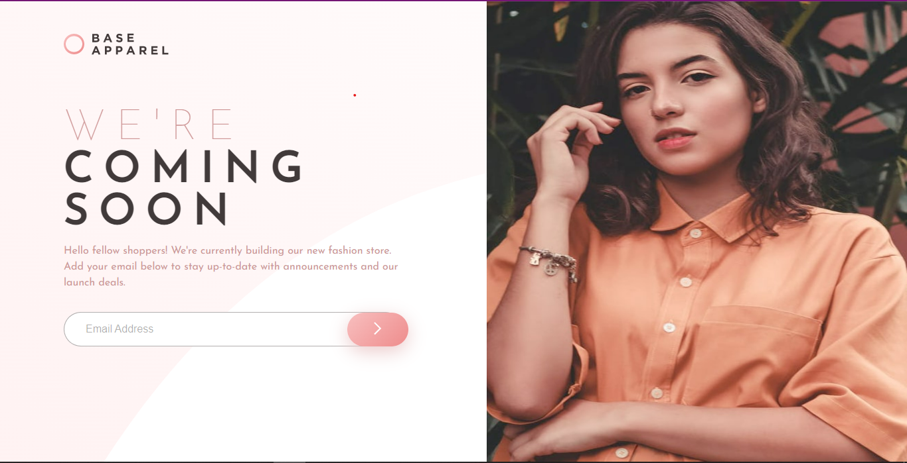

# Frontend Mentor - Base Apparel coming soon page solution

This is a solution to the [Base Apparel coming soon page challenge on Frontend Mentor](https://www.frontendmentor.io/challenges/base-apparel-coming-soon-page-5d46b47f8db8a7063f9331a0). Frontend Mentor challenges help you improve your coding skills by building realistic projects. 


**Note: Delete this note and update the table of contents based on what sections you keep.**


### Screenshot



### Links

- Solution URL: [Github Solution](https://github.com/Jemi-code/EmailValidation)
- Live Site URL: [Live Site](https://jemi-code.github.io/EmailValidation)

- Semantic HTML5 markup
- CSS custom properties
- Flexbox
- Mobile-first workflow
- Javascript


Use this section to recap over some of your major learnings while working through this project. Writing these out and providing code samples of areas you want to highlight is a great way to reinforce your own knowledge.

To see how you can add code snippets, see below:

```css
#myForm input[type = "email"]:focus{
    outline: 1px solid hsla(0, 6%, 24%, 0.404);
}

#myForm ::-webkit-input-placeholder{
    color: hsla(0, 6%, 24%, 0.404);
}

```
```js
let email_val = (event) => {
    if(regex.test(email.value)){
        email.style.border = "2px solid green";
        error.style.display = "none";
        message.innerHTML = "Valid";
        message.style.color = "green";
    } else {
        event.preventDefault();
        message.style.display = "inline";
        email.style.border = "2px solid hsl(0, 93%, 68%)";
        error.style.display = "inline";
    }
}
```

- Frontend Mentor - [@Jemi-code](https://www.frontendmentor.io/profile/Jemi-code)
